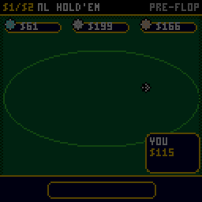
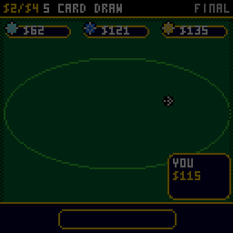
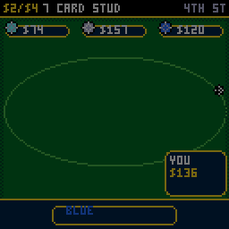
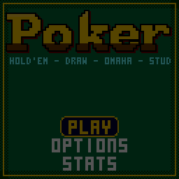
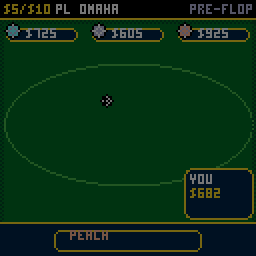
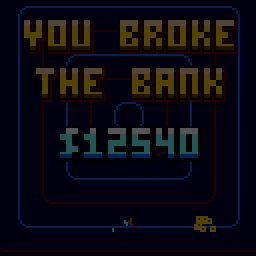

# CHPoker

Casino poker for the [CHGame](https://github.com/bateske/CH32SerialBoot)
handheld (CH32X035 RISC-V, 128x128 colour LCD, piezo), in the style of
[CHBlackjack](https://github.com/bateske/CHBlackjack) and
[CHChess](https://github.com/bateske/CHChess). Four games in one:
**Texas Hold'em** (no limit), **Five Card Draw** (fixed limit), **Omaha**
(pot limit) and **Seven Card Stud** (fixed limit), against three CPU
players at three tables, with a purse that carries over from game to game.

Cards are riffled, dealt from the middle and flipped. Chips fly to the bets,
are swept into the pot and pushed to the winner. Every seat's plate shows
its stack and what it just did. A plate at the foot of the table calls the
action ("BLUE RAISES TO $40", "GOLD SHOWS TWO PAIR"). At the showdown,
hands turn up one at a time, the winning five lift with a rainbow edge while
the cards that don't play step back, and big hands get CHBlackjack's dancing
lettering, confetti and fanfares.

| Hold'em: a royal flush | Five Card Draw | Seven Card Stud |
|---|---|---|
|  |  |  |
| **Title** | **Omaha** | **You broke the bank** |
|  |  |  |

(Captured from the PC simulator in `tools/chsim`, which runs the real game
and graphics code and renders what the device shows. `tools/scripts/showcase.txt`
makes them, with stacked decks.)

The card art, suit glyphs and 3x5 lettering come from Press Play On Tape's
Arduboy Blackjack by **filmote** (Simon Holmes) and **vampirics** (Stephane
C), via CHBlackjack. Apache-2.0, like this game; see `LICENSE` and `NOTICE`.

## Installing

You need the Arduino IDE (2.x) or `arduino-cli`, and:

1. **The CHGame board package, 0.2.4 or later** (Boards Manager URL
   `https://github.com/bateske/CH32SerialBoot/releases/latest/download/package_chgame_index.json`).
2. **The CHGfx library, 1.3.0** from <https://github.com/bateske/CHgfx>.
3. **This repository**, in a folder named `CHPoker`.

The game needs **link-time optimisation** to fit the 50,944-byte application
region: pick *Tools > Optimize > Smallest + LTO* and *Tools > USB > Upload
only* (the game has no use for USB Serial, and uploading works as before).
Built that way it takes about 48.4 KB, leaving the two flash pages it saves
in. From the command line:

    arduino-cli compile -b CHGame:ch32v:CHGame:opt=oslto,rtlib=nano,periph=game,usb=uploadonly CHPoker
    arduino-cli upload  -b CHGame:ch32v:CHGame -p COMx CHPoker

(`python tools/device.py build` does the same.)

## Playing

| Button | Your turn to bet | The draw | Elsewhere |
|---|---|---|---|
| LEFT / RIGHT | choose FOLD, CHECK or CALL, BET or RAISE, ALL IN (POT in Omaha) | move the glove along your cards and to DRAW | menus, change a setting |
| UP / DOWN | size the bet or raise in chips (hold: faster) | UP throws the card, DOWN keeps it | menus |
| A | do it | throw or keep the card; on DRAW, draw | select |
| B | | | back |
| START | pause: resume, options, hand ranks, leave the table | | |
| SELECT | | | hold on Stats to reset them |

You start with a $500 purse. In the lobby, pick the game, the table and how
much to sit down with; leaving the table puts your chips back in the purse.
Reach the goal ($10,000, $50,000 or endless, in Options) and you've broken
the bank; let the purse fall below the smallest buy-in and you're broke, and
start again with $500. Your purse, options and statistics are saved to flash
at hand ends and survive re-uploading.

| Table | Stakes | The CPUs |
|---|---|---|
| ROOKIE | $1/$2 blinds ($2/$4 limit) | call too much and rarely raise |
| PRO | $5/$10 ($10/$20) | play the odds |
| SHARK | $25/$50 ($50/$100) | tight, aggressive, bluff, and notice when you bluff |

You can sit down with 20 to 100 big blinds. A CPU that goes broke leaves,
and a new player takes the seat. When your chips run out you can buy in
again from the purse.

The CPUs judge their hands the way a player does, by imagining the rest of
the hand: each plays it out with random cards for what it can't see, tens
to hundreds of times while its plate glows and a soft clock ticks, and
weighs the share it wins against the price of calling. They never see your
cards or each other's (the tests check that changing hidden cards never
changes a decision).

### Rules

* **Hold'em**, no limit: two cards each, five on the board; blinds $1/$2
  at ROOKIE.
* **Omaha**, pot limit: four cards each, and a hand must use exactly two of
  them with three from the board.
* **Five Card Draw**, fixed limit: blinds, a round of bets, one draw of up
  to three cards (four if you keep an ace), small bets before the draw and
  big bets after.
* **Seven Card Stud**, fixed limit: antes; two cards down and one up; the
  lowest card showing (by suit: clubs, diamonds, hearts, spades) brings in,
  and from fourth street the best hand showing bets first; four up cards,
  the last one down.

Bets: in no limit a raise must at least match the last raise, and a short
all-in does not re-open the betting for players who have already acted; in
pot limit the most you can raise to is the pot after your call; fixed limit
caps a round at a bet and three raises. Uncalled bets are returned, side
pots are split at each all-in, and an odd chip goes to the first winner
left of the button. Every hand still in at the end is shown. Simplified
from casino rules: the bring-in can't complete; stud has no open-pair big
bet on fourth street; a new CPU is dealt in without posting.

## How it fits

* **Flash.** All four games, every screen and the attract demo fit in about
  48.4 KB of the 50.9 KB with LTO: the presentation is the biggest part
  (cards, chips, plates, bar, animation: ~12 KB without LTO), then the
  rules (~7.5 KB), screens (~6.3 KB), CHGfx and the core. CHGfx's circle,
  ellipse and line drawing were replaced by the rounded-rect corner table
  and a 31-byte ellipse quadrant, which saved 736 bytes.
* **The hand evaluator has no tables.** It builds a rank mask per suit and
  finds straights with four shifts and ANDs, flushes by counting bits, and
  pairs, trips and quads by counting ranks, for 1 to 7 cards at once. The
  tests check the exact category counts over all 2,598,960 five-card and
  133,784,560 seven-card hands, and the 7,462 distinct five-card scores.
* **CPU thinking is spread over frames.** Each frame runs a fixed number of
  random play-outs (16 in Hold'em, Stud and Draw, an estimated 2 ms on the board;
  one Omaha play-out is 60 five-card evaluations per player), only on the
  frame's first logic tick, so the table keeps animating and lockstep runs
  stay deterministic.
* **A still table isn't redrawn**: the frame is flushed again, so the
  palette's rainbow and gold pulses keep moving for free. A full redraw is
  estimated (from the simulator, calibrated against the board) at about
  7.4 ms.

## Development

The tools need Python 3 with `pip install -r tools/requirements.txt`, and a
C++ compiler (zig, clang++ or g++ on the PATH, `pip install ziglang`, or
`CHSIM_CXX="path/to/zig c++"`).

* `python tools/tests/run_tests.py [--long]` - the evaluator (exhaustive),
  betting spots (no-limit minimum raises, short all-ins, pot-limit maximums,
  fixed-limit caps, the stud bring-in and order), side pots, odd chips,
  uncalled bets, the draw heuristic, CPU equity and honesty, statistics,
  and a fuzz of thousands of hands of every game at every table with random
  input, checking that no chip or card is ever lost or doubled and that
  every pot is paid.
* `python tools/chsim/chdrive.py --sim . tools/scripts/showcase.txt docs/` -
  runs the game from a script and writes the GIFs above. Ops include
  `waitturn` (until the table waits for you) and `playto P` (check or call
  until the table reaches phase P); `say G <game> <table> <buy-in> <seed>`
  sits down, `say D <cards>` stacks the deck (card = rank*4 + suit).
* `python tools/device.py upload [--debug]` - build and upload (`--debug`
  adds the serial protocol for screenshots, injected input and lockstep;
  `device.py run SCRIPT OUTDIR` runs a script on the board).
* `python tools/assets.py` packs the art in `tools/art/`;
  `python tools/audio/preview.py out/` renders the sound effects to WAV.

## Files

    CHPoker.ino            loop: logic ticks, then draw, then DMA flush
    config.h               build switches
    src/game/Hand.*        the hand evaluator
    src/game/Table.*       the rules and the flow of a hand (no graphics)
    src/game/Ai.*          the CPU players
    src/game/Variant.*     the four games and three tables as data
    src/stage/Stage.*      events -> motion; drawing the table
    src/render/*           cards and chips, the action bar, layout
    src/states/Screens.*   title, lobby, play, options, stats, the endings
    src/gfx/*, src/fx/*    palette, primitives, lettering, effects
    src/audio/*, src/save/*, src/debug/*
    tools/                 simulator, tests, asset pipeline, device tools

## License

Apache License 2.0 (`LICENSE`). See `NOTICE`.
